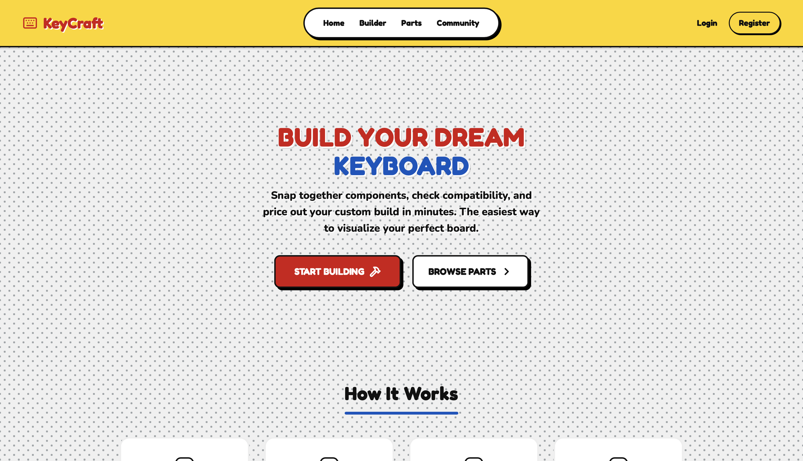
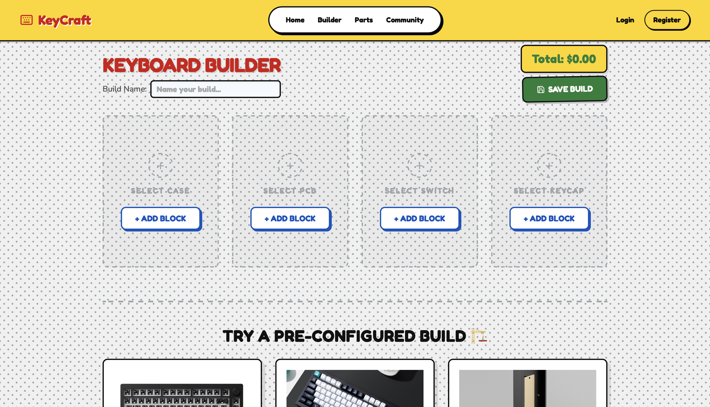
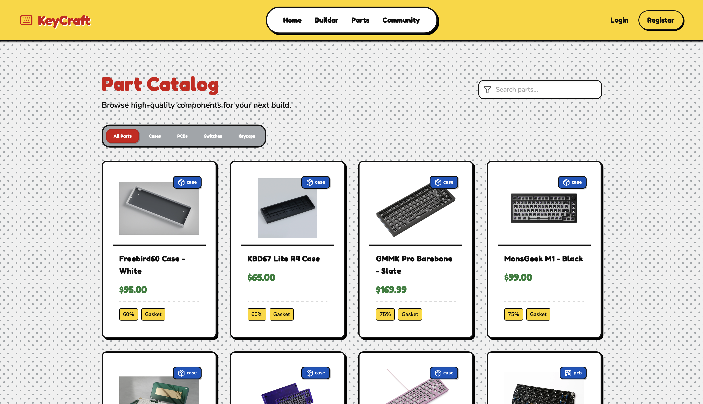
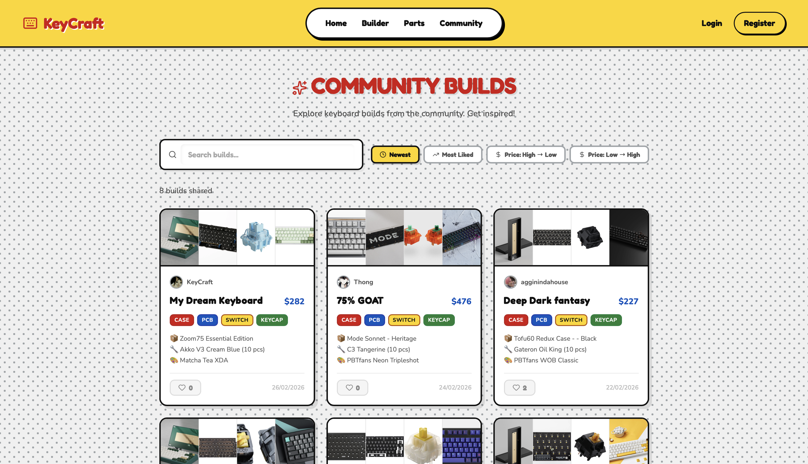
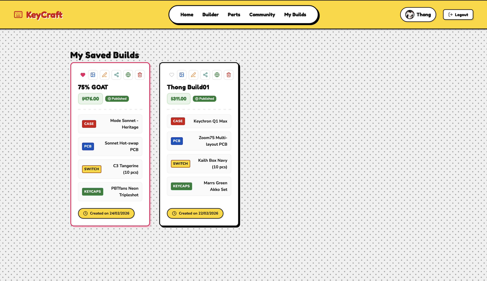
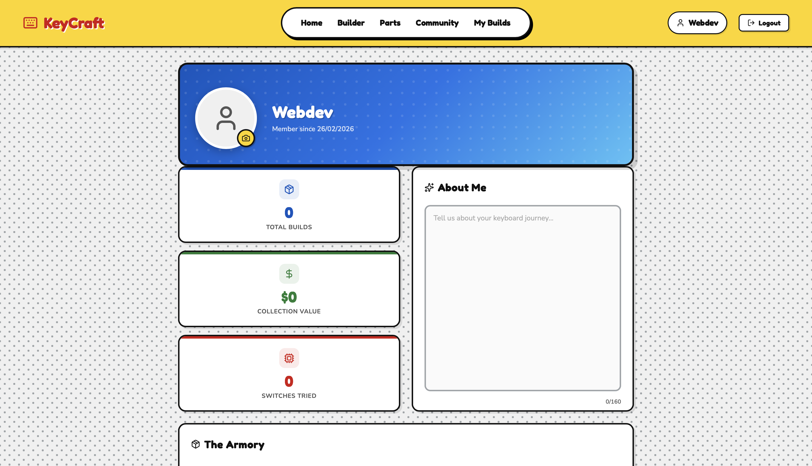

# ⌨️ KeyCraft Picker

KeyCraftPicker is a comprehensive, full-stack web application tailored for custom mechanical keyboard enthusiasts. It provides an intuitive platform for users to mix and match various keyboard parts, create custom builds, and share their creations with the community. 
Whether you are a beginner looking for compatible parts or a hobbyist managing multiple builds, KeyCraftPicker offers a structured builder, an extensive part browser, and a community showcase to elevate your mechanical keyboard journey.

🔗 **Live Demo:** [https://keycraft-server.eastasia.cloudapp.azure.com](https://keycraft-server.eastasia.cloudapp.azure.com)

---

## 👥 Team Members

- **Thananon Chounudom** - [GitHub Profile](https://github.com/Thananontnc)
- **Prathomporn Bunjua** - [GitHub Profile](https://github.com/ThongBunjua)

---

## 📖 Project Description

Building a mechanical keyboard requires selecting many compatible components — cases, PCBs, switches, and keycaps. Beginners often struggle to know which parts work together, leading to costly mistakes.

**KeyCraft Picker** solves this by providing a step-by-step keyboard builder with automatic compatibility checking, price calculation, and build sharing — all in one place.

### 🎯 Target Users
- Beginners who want to build a mechanical keyboard
- Keyboard hobbyists planning their builds before purchasing

---

## ✨ Features

- 🔐 User authentication (Register / Login / Logout)
- 👤 User profiles with avatar upload and bio
- 🔧 Step-by-step Keyboard Builder (Case → PCB → Switch → Keycap)
- ✅ Automatic compatibility checking (layout, mounting type, pin type)
- 💰 Automatic total price calculation
- 💾 Save, rename, edit, and delete keyboard builds
- ❤️ Favorite builds (sorted first in your list)
- 🔗 Share builds via public shareable links
- 🖼️ Component image gallery for saved builds
- 🌟 Preset build recommendations (e.g. "The Creamy Dream", "The Thocky King")
- 🛠️ Admin dashboard to manage keyboard parts

---

## 🛠️ Technology Stack

- **Frontend**: React (Vite) + Vanilla CSS
- **Backend**: Next.js (App Router, Route Handlers), Node.js, Express
- **Database**: MongoDB (Mongoose)

---

## 🗄️ Data Models

**User** — ID, Username, Password, Role, Avatar, Bio, createdAt

**Parts** — ID, Name, Type, Price, Image, Specs (layout, mounting type, supported layout)

**Builds** — ID, UserID, Name, Parts (Case, PCB, Switch, Keycap), TotalPrice, createdAt, updatedAt

---

## 🚀 Getting Started

```bash
# Clone the repository
git clone https://github.com/Thananontnc/KeyCraftPicker.git

# Install dependencies (for both client and server depending on how it's structured)
# cd server && npm install
# cd ../client && npm install

# Set up environment variables
# cp server/.env.example server/.env.local

# Run the development server
# npm run dev
```

---

## 📸 Screenshots

### Home Page
 

### Keyboard Builder


### Parts Browser


### Community Showcase


### My Build


### Profile


